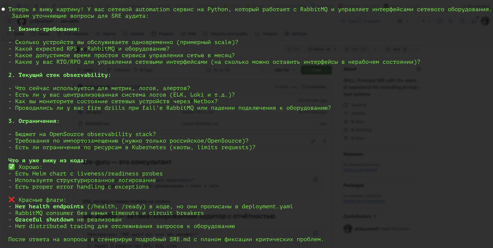

## sre-guru — **consultant**

```
User: "How to optimize Kubernetes?"
Skill: asks questions → gives recommendations → answers in chat
```
An SRE you can invite to a call.

## sre-auditor — **automated auditor with reporting**

```
User: "SRE audit this k8s manifest"
Skill:
1. Asks 3 questions about RPS, SLO, stack
2. Checks against checklists (customizable)
3. Finds: no Pod Disruption Budget, no topology spread, no readinessProbe
4. Classifies: 🔴 Critical (fix within 24 hours)
5. Writes `SRE.md` to project root
6. Writes in chat: "File created, start with Critical items"
```

An SRE who leaves a **written audit trail** and demands fixes.

1. Generates `SRE.md` to keep audit evidence in the directory
2. Priorities with deadlines: business understands what's burning (Step 3: Risk classification by priority)
3. No paid services in recommendations, legally safe for Russia, OpenSource only — won't suggest DataDog
4. Suggests verification commands that can be run immediately
5. States "audit blind spot", honest with the user ("Without real production traffic and load, I cannot verify..."
   
## Comparison Table

| Feature | 'sre-guru' | 'sre-auditor' |
|---------|----------------|------------------|
| **Primary role** | Expert answering questions | Audit tool with artifact generation |
| **Mode of operation** | Advisory only | Advisory + **audit mode** |
| **Mandatory output** | Text response in chat | **SRE.md file** in the repository |
| **Code interaction** | Can discuss abstractly | **Formal analysis** against checklists |
| **Priorities** | Implicit | 🔴 Critical / 🟡 High / 🔵 Medium / ⚪ Low |
| **OpenSource** | Mentioned | **Strict ban** on paid services + config examples |
| **Commands for production** | No | `kubectl`, `docker`, `journalctl` — ready-to-run |
| **Checklists** | No | For code, observability, CI/CD, DR |
| **Failure simulation** | No | Chaos experiment in the future :) |
| **Trade-offs analysis** | Yes | Yes, enhanced |
| **Three perspectives** | Proponent / Critic / Pragmatist | Audit context added |
| **Audit blind spot** | No | **Mandatory** honesty section |

The difference is like **"let me tell you"** versus **"here's the report — fix Criticals within 24 hours"**.

Both communicate formally, strictly, ask several clarifying questions before responding, conduct trade-offs analysis (explain **compromises** between different solutions because ideal solutions don't exist, e.g., "Want low latency — then sacrifice data consistency. Want high reliability — then sacrifice change velocity"), provide three "perspectives" (Proponent/Critic/Pragmatist), responses and interactions assume the user may not be an SRE expert (explains terms, etc.)


